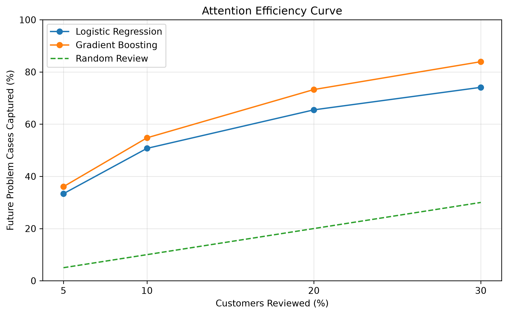
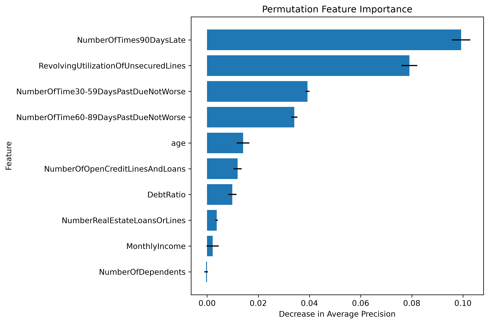
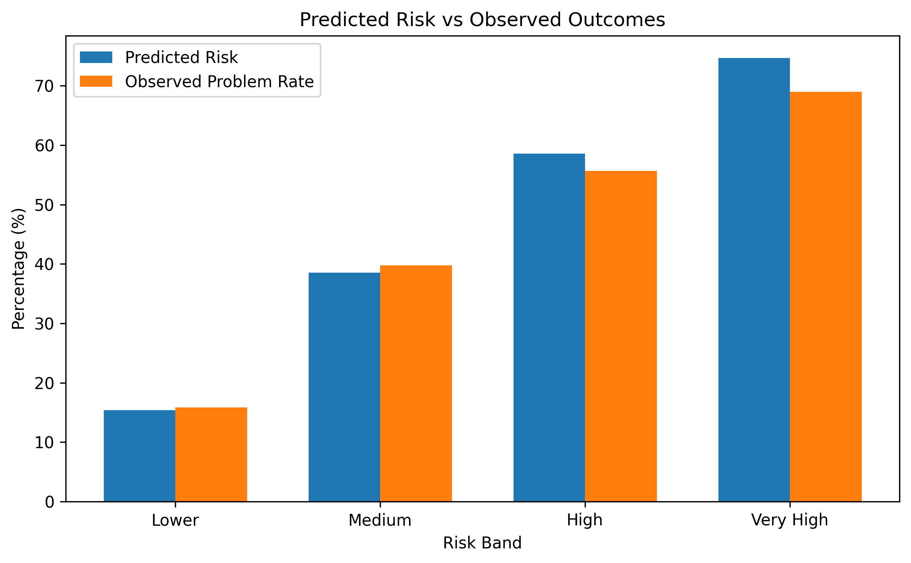

# Attention Is All We Have

**A machine-learning prototype for deciding where limited human review capacity should go first.**

Imagine a risk team with **30,000 customer accounts** but enough time to review only **6,000**. Reviewing everyone is not an option. So **which 20% should analysts look at first?**

That is the problem this project addresses. Rather than stopping at a prediction of financial distress, it turns model scores into a **ranked review queue**: the accounts an analyst could investigate first, given a fixed capacity. It then measures how many of the cases that *actually experienced serious financial distress* fall inside that queue.

**On a held-out test set, reviewing the highest-ranked 20% captured 72.97% of the observed serious-distress cases (1,463 out of 2,005).** A simple rule based only on previous severe payment delays captured 42.83% at the same capacity.



*This is a retrospective proof of concept on historical credit data, not a deployed credit-decision system. "Captured" means identified in the selected queue during evaluation; it does not mean the financial distress was prevented.*

---

## What the system actually does

1. **Prepares historical customer data**, checking anomalies and handling missing values without using test-set information during model fitting.
2. **Compares four prioritization strategies:** random selection, a transparent single-feature rule, Logistic Regression and Histogram Gradient Boosting.
3. **Ranks customers by predicted risk** and selects the highest-ranked accounts within a chosen review budget (5%, 10%, 20% or 30%).
4. **Exports a usable review queue** to CSV and SQLite, then produces SQL summaries, evaluation charts and feature-importance diagnostics.

The model does not decide whether to approve credit, nor does it replace an analyst. **It proposes where an analyst should start.**

## Results: does a more complex model earn its place?

The main question is not just *"Which model has the highest AUC?"* It is *"How many relevant cases can we find with the people and time available?"*

| Prioritization strategy | Capture at 10% review | Capture at 20% review | Capture at 30% review |
|---|---:|---:|---:|
| Random review (expected) | 10.00% | 20.00% | 30.00% |
| Previous 90+ day delays (simple rule) | 35.65% | 42.83% | 49.99% |
| Logistic Regression | 50.72% | 65.49% | 74.11% |
| **Histogram Gradient Boosting** | **55.16%** | **72.97%** | **83.79%** |

**How to interpret 72.97%:** the test set contains 30,000 accounts and 2,005 observed positive outcomes. At 20% capacity, the Gradient Boosting queue contains 6,000 accounts, of which 1,463 are positive. Its **capture rate** (recall within the review budget) is 1,463 / 2,005 = **72.97%**; its **queue precision** is 1,463 / 6,000 = **24.38%**.

The simple rule is a useful benchmark, not a straw man: previous severe delinquencies already contain meaningful information. The additional model complexity is justified here by its measured improvement in ranking quality on this held-out sample.

### Predictive metrics

| Model | ROC-AUC | Average Precision (PR-AUC summary) |
|---|---:|---:|
| Logistic Regression | 0.8145 | 0.3465 |
| **Histogram Gradient Boosting** | **0.8682** | **0.3974** |

With approximately **6.68% positive outcomes**, accuracy alone would obscure much of the distinction between strategies. That is why the project reports ranking-oriented metrics alongside standard classification metrics.

All numbers above come from the reproducibility run documented in **[VERIFICATION.md](VERIFICATION.md)**. They describe one stratified hold-out split, not guaranteed performance on new populations.

---

## From prediction to an analyst's worklist

The final Gradient Boosting model scores the held-out customer accounts and ranks them from highest to lowest predicted risk. At the chosen **20% capacity**, it exports the first 6,000 rows to:

- `data/processed/review_queue.csv` — ranked customers and review priority;
- `data/processed/attention.db` — the same selected queue, stored in a SQLite table named `review_queue`.

This makes SQL a practical part of the workflow, rather than an unrelated technology added to the project. For example:

```sql
SELECT customer_id, review_rank, predicted_risk
FROM review_queue
ORDER BY review_rank
LIMIT 10;
```

Additional queries summarize queue size, predicted-risk bands and observed positive outcomes. See [`sql/review_queue.sql`](sql/review_queue.sql) and [`src/query_database.py`](src/query_database.py).

**Important:** the exported queue includes `actual_outcome` solely because this is historical validation data. A live queue would not have access to future outcomes.

## Data and modelling choices

**Dataset:** Kaggle's [Give Me Some Credit](https://www.kaggle.com/competitions/GiveMeSomeCredit/data), with 150,000 training observations before cleaning. The target, `SeriousDlqin2yrs`, indicates serious delinquency within a two-year horizon.

The features include age, credit utilization, debt ratio, income, numbers of loans and credit lines, dependents and prior payment delays.

**Data preparation:**

- Remove the single observation with an impossible age of zero.
- Treat anomalous delinquency values `96` and `98` as missing.
- Fit missing-value imputation **inside the scikit-learn model pipelines**, using training data only.
- Use one shared stratified **80/20 train/test split** with `random_state=42` (119,999 training and 30,000 test observations after cleaning).

**Models and baselines:**

- A single-feature rule ranks accounts by previous 90+ day delinquencies; ties are randomized over **100 repetitions** and the mean capture rate is reported.
- Logistic Regression provides a straightforward statistical benchmark.
- Histogram Gradient Boosting adds nonlinear relationships and interactions.
- Random selection provides an intuitive reference for expected capture at each review budget.

The domain rule was selected for its intuitive relationship to prior severe delinquency, **not** after examining test-set feature importance.

## Explainability and diagnostics

Permutation importance measures how much **Average Precision decreases** when each feature is shuffled. The most influential variables in this analysis include previous severe payment delays and revolving credit utilization. This describes *model reliance*, not causal effects.



The following chart compares mean predicted scores with observed outcome rates across **the selected review queue's** broad risk bands:



These bands provide a descriptive diagnostic, **not** a formal probability-calibration assessment. The probabilities should not be assumed calibrated for real-world use.

---

## Run it locally

**Requirements:** Python 3.13 and the dependencies in `requirements.txt`. The exact versions used for the reported results are recorded in [VERIFICATION.md](VERIFICATION.md).

**1. Get the data.** Download `cs-training.csv` from the [Kaggle competition](https://www.kaggle.com/competitions/GiveMeSomeCredit/data), then put its ZIP archive at:

```text
data/raw/cs-training.csv.zip
```

The raw data are **not included** in this repository. The official Kaggle `cs-test.csv.zip` is not needed for these experiments because the project creates its own labeled hold-out test split.

**2. Create an environment and install dependencies.** From the repository root:

```bash
python3 -m venv .venv
source .venv/bin/activate  # macOS / Linux
python -m pip install -r requirements-dev.txt
```

On Windows, activate the environment with `.venv\Scripts\activate` instead.

**3. Run tests and generate all outputs.**

```bash
python -m pytest -q
python src/run_pipeline.py
```

`run_pipeline.py` runs data inspection, model training and comparisons, queue generation, SQLite reporting, charts and feature importance in dependency order. Outputs are written to `reports/` and `data/processed/`. The feature-importance step is computationally heavier than the other stages.

### Where to find the code

| Component | Location |
|---|---|
| Data loading, exploratory analysis and quality checks | [`src/data_loader.py`](src/data_loader.py), [`src/data_explore.py`](src/data_explore.py), [`src/data_quality.py`](src/data_quality.py) |
| Structural preprocessing | [`src/preprocess.py`](src/preprocess.py) |
| Model definitions and strategy comparison | [`src/baseline_model.py`](src/baseline_model.py), [`src/boosted_model.py`](src/boosted_model.py), [`src/model_comparison.py`](src/model_comparison.py) |
| Single-feature benchmark | [`src/simple_rule_baseline.py`](src/simple_rule_baseline.py) |
| Review queue and SQL | [`src/review_queue.py`](src/review_queue.py), [`src/build_database.py`](src/build_database.py), [`src/query_database.py`](src/query_database.py), [`sql/review_queue.sql`](sql/review_queue.sql) |
| Visual reports and model diagnostics | [`src/create_report.py`](src/create_report.py), [`src/explain_model.py`](src/explain_model.py), [`reports/`](reports/) |
| Orchestration and tests | [`src/run_pipeline.py`](src/run_pipeline.py), [`tests/`](tests/) |

## What this project does **not** claim

This is a demonstration of **retrospective ranking and capacity-constrained prioritization**, not a production risk-scoring or lending-decision product.

- The dataset is historical; performance may change across institutions or over time.
- Results use **one held-out split**, without comprehensive cross-validation or external validation.
- The capacity budget is a fixed share of accounts; review costs, consequences and business value are **not** explicitly optimized.
- Fairness, formal probability calibration, stability, data drift and human-review feedback would require additional analysis before any deployment.
- Identifying more positive outcomes in a queue **does not establish that reviewing them would prevent losses or improve customer outcomes**.

For the numerical audit, environment details and validation commands, see **[VERIFICATION.md](VERIFICATION.md)**.

---

**The central idea:** a better prediction is useful only if it improves a decision. Here, the decision is simple: **when attention is limited, where should it go first?**
